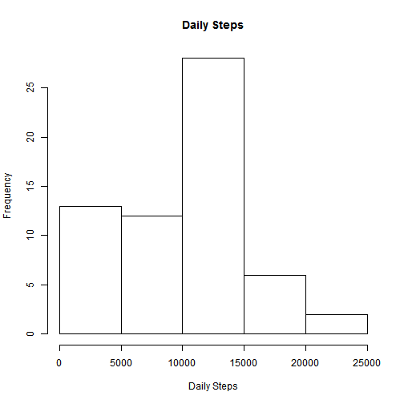

## Loading and preprocessing the data


```r
    unzip("activity.zip")
    activity <- read.csv("activity.csv")
```

## What is mean total number of steps taken per day?


```r
    dailySteps <- tapply(activity$steps, activity$date, sum, na.rm = TRUE)
    hist(dailySteps, main = "Daily Steps", xlab = "Daily Steps")
```

 

```r
    mean(dailySteps)
```

```
## [1] 9354.23
```

```r
    median(dailySteps)
```

```
## [1] 10395
```

## What is the average daily activity pattern?


```r
    intervalSteps <- tapply(activity$steps, activity$interval, mean, na.rm = TRUE)
    plot(names(intervalSteps), intervalSteps, type = "l", xlab = "5-minute interval", ylab = "Average Steps")
```

 

```r
    max(intervalSteps)
```

```
## [1] 206.1698
```

## Imputing missing values

Missing step values will be replaced with the mean of the same 5-minute interval accross all days.


```r
    sum(!complete.cases(activity))
```

```
## [1] 2304
```

```r
    suppressWarnings(library(data.table))
    activity$steps <- as.numeric(activity$steps)
    activity_imputed <- data.table(activity)[, steps := ifelse(is.na(steps), mean(steps, na.rm = TRUE), steps), by = interval]
    dailySteps <- tapply(activity_imputed$steps, activity_imputed$date, sum)
    hist(dailySteps, main = "Daily Steps", xlab = "Daily Steps")
```

 

```r
    mean(dailySteps)
```

```
## [1] 10766.19
```

```r
    median(dailySteps)
```

```
## [1] 10766.19
```

## Are there differences in activity patterns between weekdays and weekends?


```r
    suppressWarnings(library(lattice))
    weekend <- factor(weekdays(as.Date(activity_imputed$date))) %in% c('Saturday','Sunday')
    activity_imputed$weekday = factor(weekend, c(TRUE, FALSE), c("weekend", "weekday"))
    dailySteps <- aggregate(activity_imputed$steps, list(interval = activity_imputed$interval, weekday = activity_imputed$weekday), mean)
    xyplot(x ~ interval | weekday, data = dailySteps, ty=c("l"), layout=c(1,2), xlab = "5-minute interval", ylab = "Average Steps")
```

 
